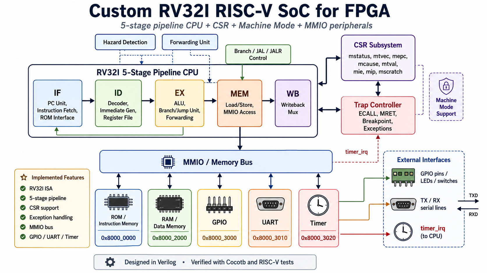

# RV32I SoC for FPGA

Custom RISC-V RV32I System-on-Chip written in Verilog.

  

Features:

- RV32I 5-stage pipeline CPU
- CSR subsystem
- Machine mode support
- Exception handling
- ECALL / MRET
- MMIO bus
- GPIO peripheral
- UART peripheral
- Timer peripheral
- Hazard detection
- Data forwarding
- Cocotb verification environment

Verification status:

- RV32UI: 38/38 PASS
- RV32MI CSR: PASS
- RV32MI SCALL: PASS
- RV32MI BREAKPOINT: PASS

Target FPGA:

- Xilinx Zynq-7000

<a href="RISCV_ZYNQ/V2/RVI20U32/RV32I_COCOTB/RISCV_RV32UI/RV32UI.pdf">
📄 Open RV32UI Architecture PDF
</a>

<a href="RISCV_ZYNQ/V2/RVI20U32/RV32I_COCOTB/RISCV_RV32MI/RV32MI.pdf">
📄 Open RV32UI Architecture PDF
</a>

